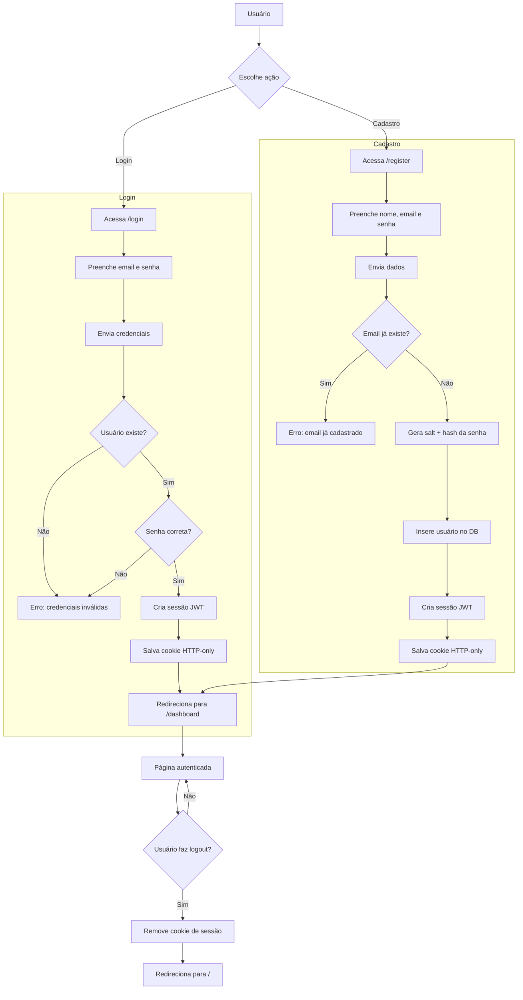

# Next.js Simple Auth


> Projeto de exemplo de autenticação com Next.js + Drizzle ORM (SQLite) usando sessões JWT em cookie.

## 🔍 Descrição

**nextjs-simple-auth** é um exemplo minimalista de autenticação com Next.js (App Router), Drizzle ORM (SQLite) para persistência, e sessões baseadas em JWT armazenadas em cookie HTTP-only. O objetivo é demonstrar um fluxo simples e seguro de **Login**, **Cadastro** e **Logout** com boas práticas (hash de senha, salt, validações com Zod).

### 🏗️ Arquitetura de Autenticação

**Fluxo simplificado:**

1. **Server Actions** (`src/actions.ts`): Funções server-side que validam credenciais, criam usuários e gerenciam sessões via cookies
2. **Session Management** (`src/lib/session.ts`): Cria e gerencia tokens JWT armazenados em cookies HTTP-only
3. **Client State** (`src/components/AuthProvider.tsx`): Context API para gerenciar estado do usuário no cliente
4. **Components**: Formulários e navbar que interagem com as server actions e atualizam o estado do cliente

**Como funciona:**

- **Login/Registro**: 
  - Formulário envia dados para server action
  - Server action valida no banco de dados
  - Se válido, cria sessão JWT no cookie
  - Cliente busca usuário do servidor e atualiza estado local
  - Navbar reflete mudança instantaneamente

- **Estado da Sessão**:
  - Sessão armazenada em cookie HTTP-only (seguro contra XSS)
  - Estado do usuário no cliente via React Context (para UI reativa)
  - Sincronização automática: login/registro atualizam ambos

- **Logout**:
  - Server action limpa o cookie de sessão
  - Redireciona para home
  - Estado do cliente é resetado no próximo carregamento

## ✨ Recursos principais

- Autenticação com senha (salt + hash)
- Criação de conta (registro)
- Sessões via JWT armazenadas em cookie (HTTP-only)
- ORM: Drizzle (schema e queries em `src/db`)
- Validações com Zod (`src/schema`)

---

## 🔁 Fluxo (diagrama)

Abaixo está um diagrama Mermaid com o fluxo de Login, Cadastro e Logout:



> Observação: os passos de verificação de senha e criação de sessão ocorrem no lado servidor (em `src/actions.ts` e `src/lib/session.ts`).

---

## 🚀 Como rodar (rápido)

1. Instale dependências:

```bash
pnpm install
```

2. Crie um arquivo `.env` com as variáveis necessárias (exemplo):

```env
DB_FILE_NAME=./db/sqlite.db
SESSION_SECRET=uma_chave_secreta_muito_segura
```

3. Rode em modo desenvolvimento:

```bash
pnpm dev
```

Abra `http://localhost:3000`.

---

## 🧩 Integração com Drizzle

- O schema está em [src/db/schema.ts](src/db/schema.ts) (tabela `users`).
- O cliente `db` é exportado em [src/db/index.ts](src/db/index.ts) e usado nas ações ([src/actions.ts](src/actions.ts)) para consultas e inserções.

---

## 🔧 Estrutura do Código

### Server-Side (Segurança)
- **[src/actions.ts](src/actions.ts)**: Server actions para `signIn`, `signUp`, `logOut`, `getCurrentUser`
- **[src/lib/session.ts](src/lib/session.ts)**: Funções `createSession`, `deleteSession`, `getSession` (JWT em cookies)
- **[src/lib/password.ts](src/lib/password.ts)**: Hash de senhas com salt
- **[src/schema/auth.ts](src/schema/auth.ts)**: Validações Zod para dados de entrada

### Client-Side (UI)
- **[src/components/AuthProvider.tsx](src/components/AuthProvider.tsx)**: Context API para estado do usuário
- **[src/components/Navbar.tsx](src/components/Navbar.tsx)**: Navbar que carrega usuário do servidor e exibe UI condicional
- **[src/components/LoginForm.tsx](src/components/LoginForm.tsx)** e **[RegisterForm.tsx](src/components/RegisterForm.tsx)**: Formulários que chamam server actions

### Database
- **[src/db/schema.ts](src/db/schema.ts)**: Schema Drizzle (tabela `users`)
- **[src/db/index.ts](src/db/index.ts)**: Cliente Drizzle ORM

---

## 📝 Nota sobre rotas de API

As rotas da pasta `src/app/api/*` foram removidas neste repositório porque o frontend atual gerencia sessão localmente via `AuthProvider` (localStorage) e **não** faz chamadas para `/api/*`. Se você precisa de endpoints para integrações externas, testes E2E ou autenticação server-side, podemos adicioná-los novamente ou migrar o frontend para utilizar essas APIs.

---

## 🛠️ Notas de implementação

- **Senhas**: Geradas com salt + hash ([src/lib/password.ts](src/lib/password.ts))
- **Sessão**: JWT com expiração de 10 segundos para demonstração ([src/lib/session.ts](src/lib/session.ts)). Em produção, use tempos maiores (ex: 7 dias)
- **Validações**: Zod em [src/schema](src/schema) para garantir dados válidos
- **Cookies**: HTTP-only, Secure, SameSite=Lax para segurança
- **Estado**: AuthProvider sincronizado com servidor via `getCurrentUser()` - não usa localStorage

### ⚠️ Importante para Produção

1. **Aumente o tempo de expiração da sessão** em [src/lib/session.ts](src/lib/session.ts#L23) (atualmente 10 segundos)
2. **Configure variável `SESSION_SECRET`** com valor aleatório forte
3. **Use HTTPS** em produção (necessário para cookies secure)
4. **Adicione rate limiting** para prevenir ataques de força bruta
5. **Implemente refresh tokens** para sessões de longa duração

---

## ♻️ Contribuições

Contribuições são bem-vindas. Abra issues ou PRs com melhorias (tests, CI, melhor fluxo de sessão, etc.).

---

## 📄 Licença

MIT

